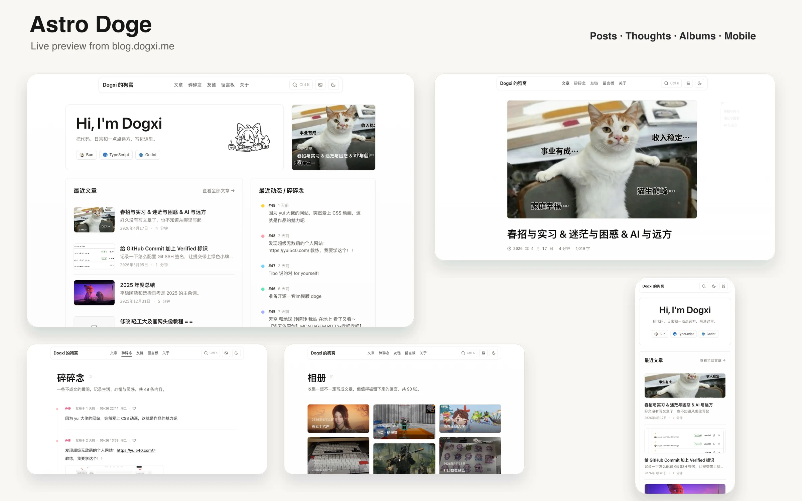

# Astro Doge

一个静态优先、但可按需打开动态能力的 Astro 6 博客模板。

基于 [Astro](https://astro.build) 和 [Tailwind CSS v4](https://tailwindcss.com) 构建，默认就能提供文章、碎碎念、相册、搜索、RSS、PWA、目录导航等能力；仓库同时内置了可直接部署到 Vercel 的 `api/` 路由，用来支持评论、留言板、碎碎念点赞、相册和网页端发布。

## 预览



<details>
  <summary>Lighthouse 全绿，展开查看</summary>


</details>

## 模板包含什么

- 静态优先：默认输出静态站点，纯内容博客可以直接部署到任意静态托管平台
- 内容系统：Markdown / MDX 文章、碎碎念与相册，附带创建脚本
- 阅读体验：目录导航、图片灯箱、标题锚点、阅读时长、相关文章
- 内容输出：RSS、`robots.txt`、sitemap、PWA、外链标记、GitHub Alerts
- 本地搜索：`Ctrl+K` / `Cmd+K` 呼出搜索框
- 可选动态能力：GitHub Issues 评论 / 留言板、碎碎念点赞、`/thoughts/new` 和 `/moments/new` 在线发布

## 快速开始

### 1. 获取模板并安装依赖

```bash
git clone https://github.com/dogxii/astro-doge.git my-blog
cd my-blog
bun install
```

如果你习惯用 GitHub Template，也可以直接从仓库页面点击 `Use this template` 创建自己的博客仓库。

### 2. 修改基础配置

至少先改这几个地方：

- `astro.config.mjs`
  把 `site` 改成你的线上域名，并把 `allowHostnames` 改成自己的域名
- `src/consts.ts`
  修改站点名、描述、作者、邮箱、社交链接、项目和技术栈
- `public/avatar.png`、`public/favicon.ico`、`public/manifest.json`
  替换头像、站点图标和 PWA 信息

如果只是本地试用，可以先跳过这一步。

### 3. 本地开发

```bash
bun dev
```

打开 `http://localhost:4321`。

### 4. 写内容

```bash
bun new:blog my-first-post
bun t random-note "今天又学到一个新东西"
```

文章、碎碎念和相册也可以直接手动放进这些目录：

- `src/content/posts/`
- `src/content/thoughts/`
- `src/content/albums/`

### 5. 构建检查

```bash
bun run build
```

构建产物会输出到 `dist/`。

### 6. 部署

这个模板可以部署到 Vercel 以外的平台。

如果你只需要文章、碎碎念、相册、搜索、RSS、PWA 这些静态能力，直接把 `dist/` 部署到任意静态托管平台即可，例如：

- Netlify
- Cloudflare Pages
- GitHub Pages
- Vercel
- 你自己的 Nginx / Caddy 静态服务器

常见配置：

| 平台                          | Build Command   | Output Directory |
| ----------------------------- | --------------- | ---------------- |
| Vercel / Netlify / Cloudflare | `bun run build` | `dist`           |
| GitHub Pages                  | `bun run build` | `dist`           |

如果要使用内置评论、留言板、点赞、网页端发布和图片上传代理，推荐部署到 Vercel。仓库根目录的 `api/` 是 Vercel Serverless API 写法，其他平台不能直接无改动复用；你可以按 [API Contract](./docs/api-contract.md) 在 Netlify Functions、Cloudflare Workers 或自己的服务里实现同样接口。

## 初始化时先改这些

- `astro.config.mjs`
  设置 `site`，并把 `allowHostnames` 改成你自己的域名
- `src/consts.ts`
  站点名、描述、邮箱、社交链接、项目、技术栈都在这里
- `src/pages/about/index.astro`
  默认 About 页面文案
- `src/components/Header.astro`
  导航链接
- `src/components/Footer.astro`
  页脚署名和链接
- `public/avatar.png`、`public/favicon.ico`、`public/manifest.json`
  头像、图标和 PWA 元数据
- `src/content/posts/`、`src/content/thoughts/`、`src/content/albums/`
  删除示例内容，换成你自己的文章、碎碎念和相册

## 写内容

### 写文章

```bash
bun new:blog my-first-post
```

或者手动在 `src/content/posts/` 下创建 `.md` / `.mdx` 文件：

```md
---
title: 我的第一篇文章
description: 一段摘要
date: 2026-04-23T09:00:00+08:00
slug: my-first-post
cover: /images/my-cover.webp
draft: false
---

正文内容。
```

### 写碎碎念

```bash
bun t
```

也可以直接带上文件名和内容：

```bash
bun t random-name "今天天气不错"
```

或者手动在 `src/content/thoughts/` 下创建文件：

```md
---
date: 2026-04-23T09:00:00+08:00
draft: false
tags:
  - dev
  - note
---

今天又学到一个新东西。
```

### 写相册

相册内容放在 `src/content/albums/`，可以使用本地图片路径，也可以使用外部图床 URL：

```md
---
title: 一张照片
date: 2026-04-23T09:00:00+08:00
src: /images/photo.webp
thumb: /images/photo-thumb.webp
alt: 照片描述
description: 可选说明
location: Zhengzhou
width: 1600
height: 1200
draft: false
---
```

## 部署方式

### 1. 纯静态部署到任意平台

这是模板默认工作方式，也是最省心的部署方式：

```bash
bun run build
```

产物在 `dist/`，可以直接部署到：

- Netlify
- Cloudflare Pages
- GitHub Pages
- Vercel
- 自己的静态服务器

这时评论、留言板、点赞、图片上传和在线发布不会生效，但页面本身仍可正常访问。

### 2. Vercel 部署内置 API

如果你想直接复用仓库里的动态能力，不需要自己重写后端，推荐把整个项目部署到 Vercel。模板已经包含：

- `api/comments.ts`
- `api/submit-comment.ts`
- `api/likes.ts`
- `api/add-thought.ts`
- `api/add-album.ts`
- `api/upload-sign.ts`
- `api/upload-complete.ts`
- `vercel.json`

部署说明见：

- [Vercel 部署指南](./docs/deploy-vercel.md)
- [API Contract](./docs/api-contract.md)

内置 API 当前支持：

- 文章评论和留言板
- 碎碎念点赞
- `/thoughts/new` 在线发布
- `/moments/new` 在线发布相册
- 通过你自己的上传签名服务接入图片上传

### 3. 其他平台 + 自己的 API

如果你想部署在 Vercel 以外的平台，同时保留动态能力，有两种做法：

- 只把前端静态站点部署到 Netlify / Cloudflare Pages / GitHub Pages，动态接口放到自己的后端服务
- 把 [API Contract](./docs/api-contract.md) 里的接口迁移到 Netlify Functions、Cloudflare Workers、Node.js 服务或其他 Serverless 平台

前端只关心接口路径和返回 JSON，不要求后端一定运行在 Vercel。

## 环境变量

如果你只运行纯静态博客，可以完全不配置环境变量。

如果你要启用内置 API，优先参考 [.env.example](./.env.example)。常用变量如下：

| 变量                                         | 用途                                              |
| -------------------------------------------- | ------------------------------------------------- |
| `SITE_URL`                                   | 站点地址，用于生成链接和 CORS                     |
| `GITHUB_TOKEN`                               | 访问 GitHub API 的 Fine-grained Token             |
| `COMMENTS_REPO`                              | 评论 / 留言板仓库，格式 `owner/repo`              |
| `LIKES_REPO`                                 | 点赞数据仓库，格式 `owner/repo`                   |
| `CONTENT_REPO`                               | `/thoughts/new` 写入的内容仓库，格式 `owner/repo` |
| `GITHUB_REPO`                                | 通用回退仓库；如果不想拆多个仓库，可以只配它      |
| `CONTENT_BRANCH`                             | 在线发布写入的分支，默认 `main`                   |
| `THOUGHTS_CONTENT_DIR`                       | 在线发布写入目录，默认 `src/content/thoughts`     |
| `ALBUMS_CONTENT_DIR`                         | 相册在线发布写入目录，默认 `src/content/albums`   |
| `SITE_TIMEZONE`                              | 在线发布时间和点赞日切使用的时区                  |
| `OWNER_NAME` / `OWNER_EMAIL` / `OWNER_TOKEN` | 博主身份校验                                      |
| `PUBLIC_OWNER_NAME` / `PUBLIC_OWNER_EMAIL`   | 前端用于提示博主输入 token，后者可选              |
| `THOUGHT_API_TOKEN`                          | `/thoughts/new` 和 `/moments/new` 使用的发布口令  |
| `R2_IMAGE_BASE_URL`                          | 可选图片上传签名服务地址                          |
| `COMMENT_AUTHOR_LOGIN`                       | 可选，只读取指定 GitHub 用户创建的评论            |

## 什么时候需要自己写后端

如果你不用 Vercel，或者不想把数据存在 GitHub Issues / 仓库里，也可以自己实现后端。前端已经约定好了接口格式，见 [docs/api-contract.md](./docs/api-contract.md)。

## 项目结构

```text
.
├── api/                  # Vercel Serverless API
├── docs/                 # 额外文档
├── public/               # 静态资源
├── scripts/              # 创建文章 / 碎碎念的辅助脚本
├── src/
│   ├── components/       # 组件
│   ├── content/          # 示例内容
│   ├── layouts/          # 布局
│   ├── lib/              # 工具函数
│   ├── pages/            # 页面与路由
│   ├── styles/           # 全局样式
│   ├── consts.ts         # 站点配置
│   └── content.config.ts # 内容集合定义
├── .env.example
├── astro.config.mjs
├── package.json
├── tsconfig.json
└── vercel.json
```

## 致谢

- 主题基于 [astro-nano](https://github.com/markhorn-dev/astro-nano) 演化而来
- 碎碎念和留言板交互设计参考了 [Viki](https://github.com/vikiboss/blog) 的一些思路

## License

[MIT](./LICENSE)
